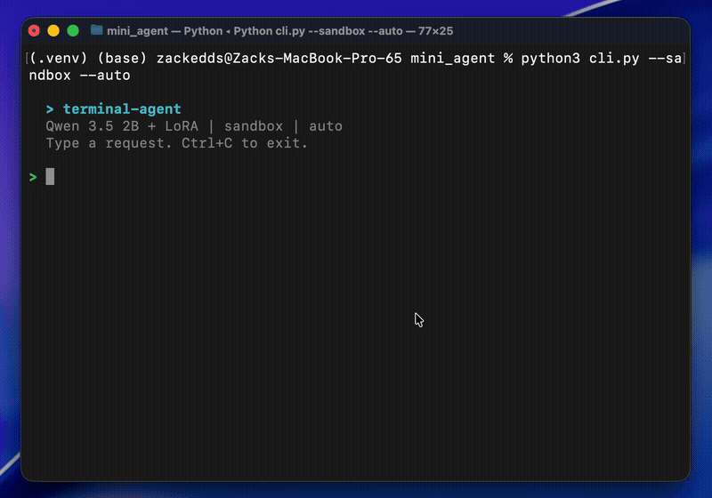
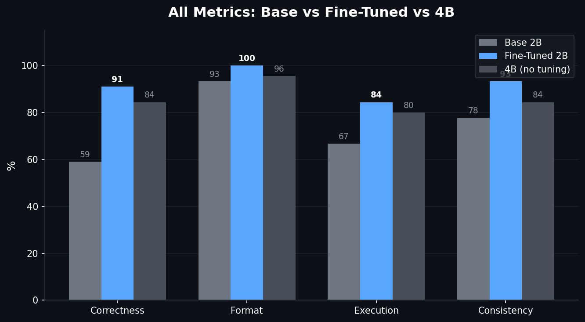
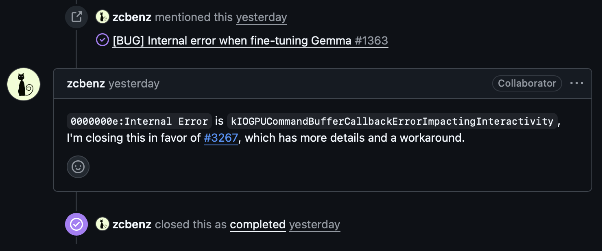
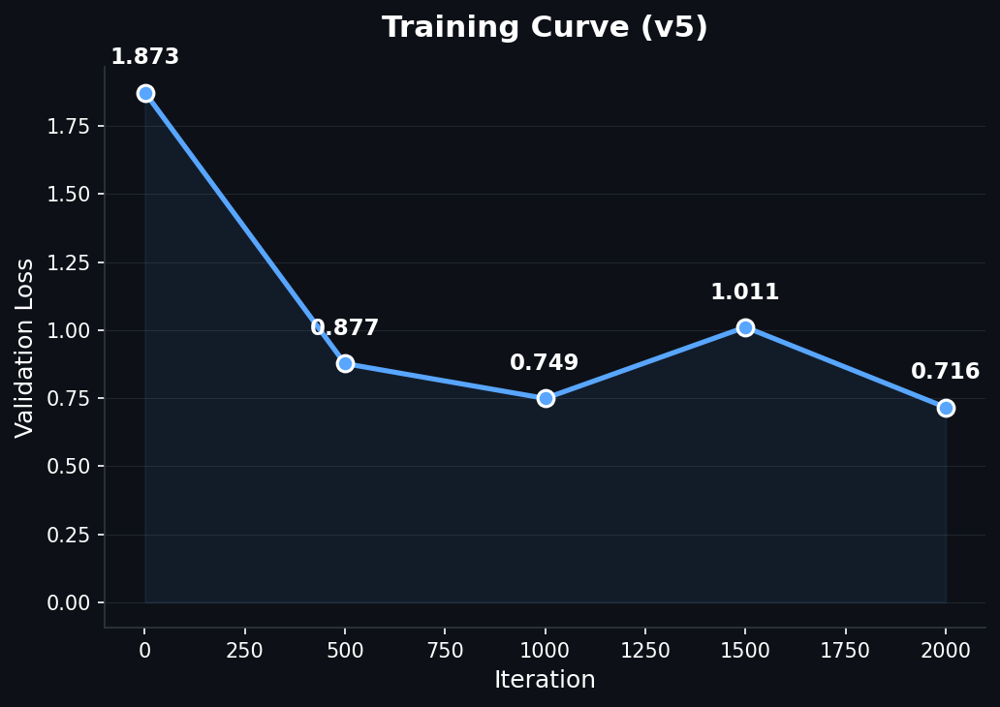
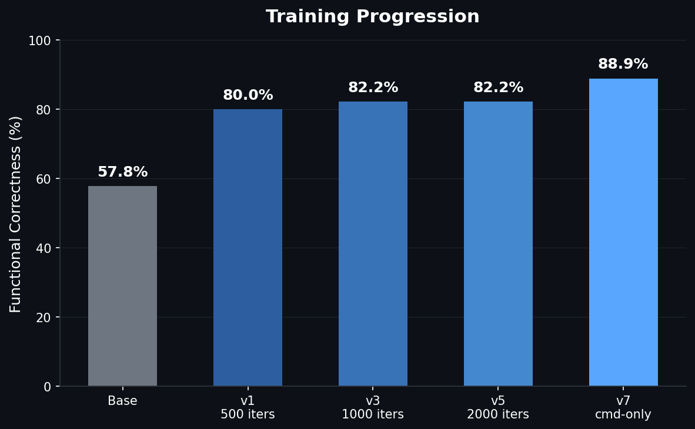
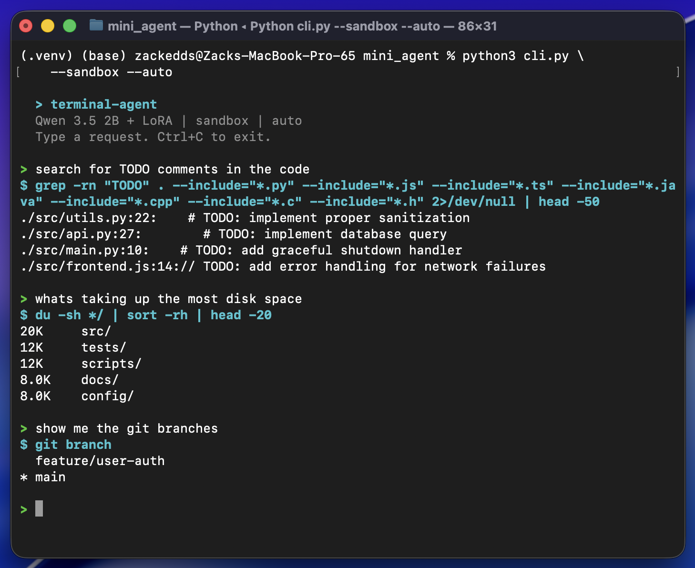

# Fine-Tuning a 2B Terminal Assistant on Apple Silicon
*QLoRA, knowledge distillation, a GPU bug investigation, and what LoRA can't learn*

`SFT` `QLoRA` `MLX` `Apple Silicon` `Qwen 3.5` `CLI Agent` `Distillation` `On-Device ML` `Metal GPU`



**TL;DR:** Fine-tuned a 2B parameter model to be a terminal assistant using QLoRA on a MacBook. 59% → 91% accuracy on bash command generation. Discovered a macOS GPU bug along the way and got an undocumented fix from the MLX team. Everything runs locally, trained in 28 minutes, $0 compute cost. **[GitHub Repo](https://github.com/zackedds/terminal-agent)**

---

I wanted to build a terminal assistant that runs entirely on my laptop. No API calls, no cloud GPUs, no subscriptions. Just a tiny language model that lives on-device and knows how to write bash commands. The idea: use a frontier model (Claude Sonnet) to generate thousands of expert bash examples, then fine-tune a **2B parameter model** on that data so it runs locally on a MacBook Pro M2 Pro with 16GB of RAM.

The base model could already follow the tool-calling format most of the time (**92% format compliance**), but the actual commands it generated were **wrong nearly half the time**. It knew *how* to call the tool, just not *what* to put in it. Fine-tuning with high-quality examples fixed that mapping.

This is the story of how that went, including the part where macOS and my ML training were fighting over the GPU.

## Picking the Base Model

I evaluated three candidates from the Qwen family, running each through my eval suite before writing a single line of training code:

| Model | Correctness | Tok/sec | RAM | Notes |
|---|---|---|---|---|
| Qwen3-1.7B* | 42.2% | ~118 | 1.0 GB | Got stuck in reasoning loops, rarely produced commands |
| Qwen3.5-2B | 57.8% | ~85 | 1.4 GB | Good format compliance, but wrong commands |
| Qwen3.5-4B | 84.4% | ~43 | 2.9 GB | Already strong, not much room to improve |

*Qwen3-1.7B is the previous generation's smallest text model. Qwen 3.5's smallest text model is the 2B (the 0.8B is vision-only).

The 2B was the sweet spot. It understood the output format but consistently failed on the hard stuff: compound tasks (42.9%), git operations (42.9%), and safety refusals (60%). Clear weaknesses with clear room to improve. And at 85 tokens/sec with 1.4 GB of RAM, it's fast enough to feel interactive and light enough to run alongside everything else on a 16GB laptop. The 4B is twice the memory and half the speed for a tool that should feel instant.

## Eval First, Train Second

Before touching any training code, I built the evaluation environment.

The setup:

- **Docker sandbox** running Ubuntu 22.04 with a realistic developer workspace (Python/JS webapp, git history, multiple branches, log files)
- **Network isolation** so nothing phones home
- **Fresh container per trial** so tests can't contaminate each other
- **67 test cases** across 7 categories, each run **3 times** (201 total trials per evaluation)
- **Automated scoring** on format compliance, syntax validity, execution success, functional correctness, and consistency

This eval-first approach meant every training decision was data-driven. When a later training run regressed, I didn't have to guess. The numbers told me exactly what broke and by how much.

## Training Data: Generating Examples With Claude Sonnet

The training data came from Claude Sonnet. I spawned parallel Sonnet agents, each responsible for a category:

- Git workflows (branches, diffs, rebasing, stashing)
- File and directory operations (find, ls, permissions, disk usage)
- Text processing (grep, sed, awk, sort, pipelines)
- System info and process management
- Multi-step compound tasks (3+ stage pipes)
- Safety refusals for dangerous commands

Each example used Qwen3.5's native tool-calling format: a `<think>` block for reasoning, followed by a `<tool_call>` XML block with the bash command. Total yield: 3,113 unique examples.

I verified the initial batch of commands by executing them in the Docker sandbox. About half failed, but every failure was a sandbox limitation (missing files, tools not installed in the container). **Zero bash syntax errors** across the entire dataset.

## Training: QLoRA on Apple Silicon

Training used QLoRA through MLX, Apple's native ML framework for Apple Silicon. The setup:

- 4-bit quantized base model (~1.2GB in memory)
- LoRA rank 8, targeting 8 layers
- Dropout: 0.05
- Learning rate: 1e-5 with cosine decay and warmup
- ~2000 iterations

The whole thing trained in **28 minutes** on the M2 Pro. No cloud. No CUDA. Just the laptop's GPU.

**Results:**

| Metric | Base 2B | Fine-Tuned 2B | 4B (no fine-tuning) |
|---|---|---|---|
| Functional Correctness | 57.8% | **82.2%** | 84.4% |
| Format Compliance | 93.3% | **100%** | 95.6% |
| Execution Success | 66.7% | **84.4%** | 80.0% |
| Consistency | 77.8% | **93.3%** | 84.4% |

The fine-tuned 2B beat the 4B base model on execution success, format compliance, and consistency. An 11MB LoRA adapter closed a 26-point gap and made a 2B model competitive with one twice its size.



## The GPU Bug

Now for the part that cost me a full day.

Training kept crashing somewhere between iteration 100 and 400 with this:

```
[METAL] Command buffer execution failed: Impacting Interactivity
(0000000e:kIOGPUCommandBufferCallbackErrorImpactingInteractivity)
```

My first assumption was out of memory. It's always out of memory, right? Except:

- Peak GPU usage was **2.75GB out of 16GB** available (17% utilization)
- My config was **more conservative than mlx-lm's defaults** on every single parameter: smaller batch size, fewer layers, shorter sequences

### Going Down the Wrong Path

I tried everything the internet suggested:

```bash
export MLX_MAX_OPS_PER_BUFFER=1    # Reduced crash frequency, didn't fix
export MLX_MAX_MB_PER_BUFFER=10    # Still crashed
```

Reduced LoRA layers. Shortened sequence length. Nothing worked reliably.

I ended up writing an auto-resume script that detected crashes and restarted training from the last checkpoint. It technically worked (training completed), but **80 minutes of actual compute took 6 hours** because of the crash-resume overhead. This is not a solution. This is duct tape.

### Wait, What Does the Error Actually Say?

The error didn't say "timeout." It didn't say "out of memory." It said **"Impacting Interactivity."** That's a specific term. It means: "your GPU work is blocking the UI compositor."

Apple Silicon has a **unified GPU**. The same hardware that runs your ML training also composites every window on your screen. macOS has a watchdog that kills GPU tasks if they block the display pipeline for too long. macOS Tahoe's updated UI adds some additional GPU compositing work for WindowServer, which tightens the margin for compute workloads on the shared GPU.

My hypothesis: if there's no display to composite, the watchdog has nothing to protect.

### The Experiment: Display On vs. Display Off

Three controlled runs, same model, same config. Display off = close the laptop lid with `caffeinate -s` to keep the system awake:

| Test | Display | Buffer env vars | Result |
|---|---|---|---|
| A | On | Yes | CRASHED at iteration 10 |
| B | Off | Yes | PASSED 500 iterations |
| C | Off | No | PASSED 500 iterations |

Turning off the display was the entire fix. Not the environment variables, not the config changes. With no display, WindowServer has nothing to composite, and the watchdog has nothing to defend.

I then built a minimal reproduction to isolate the variable:

- Same model, same LoRA config, **short training examples** (~40 tokens each): **no crash**
- Same model, same LoRA config, **long training examples** (~256 tokens): **crashed every time**

The variable was **per-iteration GPU time**. Longer sequences meant longer individual Metal operations that blocked the compositor past the watchdog threshold.

### Filing the Bug

I opened an issue on [ml-explore/mlx (#3267)](https://github.com/ml-explore/mlx/issues/3267) with the 5 controlled runs, the `caffeinate` workaround, and the minimal reproduction showing the sequence-length threshold.

It turned out this was related to a [long-standing issue (#1231)](https://github.com/ml-explore/mlx/issues/1231) that had been open since June 2024, originally filed by one of the MLX co-creators. That issue had been opened, closed, reopened, and referenced across multiple bug reports over two years without a clear resolution. The MLX team ended up closing the original in favor of mine, since the controlled experiments and workaround provided the missing detail.



### The Fix

An MLX collaborator replied with a single environment variable:

```bash
export AGX_RELAX_CDM_CTXSTORE_TIMEOUT=1
```

It tells the AGX (Apple GPU) driver to relax the context store timeout, the exact watchdog that was killing training runs. This variable **doesn't appear anywhere on the public internet**. Not in documentation, not on Stack Overflow. Only someone with access to the GPU driver source would know it exists.

I tested it immediately: full 2000-iteration training run, **lid open, zero crashes, 28 minutes flat**.

The lesson here isn't "close your laptop lid." The lesson is that a well-documented bug report with controlled experiments and a minimal reproduction gets you answers that no amount of googling ever will.

## When More Training Made Things Worse

With the GPU bug solved, I trained longer expecting better results.

With 1,240 examples:
- **1000 iterations (0.8 epochs): 82.2%**, best result
- **4000 iterations (3.2 epochs): 73.3%**, worse

The train loss told the story: it was **0.037** at the start of the extended run. The model had memorized the dataset before the extra training even began. But memorization alone doesn't explain why test accuracy *dropped*. I later discovered the dataset contained **contradictory training signals** (command examples and safety/refusal examples pulling the model in opposite directions), which I'll get into in the task interference section below. The memorization amplified those contradictions.

The immediate fix:

- Add **dropout (0.05)** to regularize
- Use **cosine learning rate decay** instead of constant
- **Double the training data** to 2,177 unique examples

With the larger dataset, the model trained for 2000 iterations while maintaining a healthy train loss of 0.439, confirming it was learning generalizable patterns rather than memorizing.



## Where Things Stand

After removing the conflicting safety data and retraining, the model translates natural language into bash commands at ~91% accuracy:

- **91% correctness** on command tasks (up from 59% base)
- **100% format compliance**, **98.5% consistency**
- Runs entirely on a MacBook (~1.2GB quantized model + 11MB LoRA adapter)
- Generates responses in 2-5 seconds
- Trained in 26 minutes with $0 in compute costs

A few of the remaining failures are false negatives from eval strictness (correct commands that fail in the sandbox due to missing tools), not actual model errors. Safety is handled at the application layer with a command blacklist and approval workflow rather than in the model weights.



## Using It For Real



Eval numbers are one thing. Actually using it is another. Here's what a real session looks like:

```
> how many lines of code are in each python file
  $ find . -name "*.py" | xargs wc -l
   11 ./tests/test_utils.py
    7 ./tests/test_api.py
   34 ./src/utils.py
   30 ./src/api.py
   14 ./src/main.py
   96 total

> find all files that contain the word flask
  $ grep -rl "flask" . --include="*"
  ./requirements.txt

> show disk usage by directory sorted biggest first
  $ du -sh */ | sort -rh
  20K   src/
  12K   tests/
  12K   scripts/
  8.0K  docs/
  8.0K  config/

> create a file called notes.txt with the text hello world
  $ echo "hello world" > notes.txt
```

It handles the everyday stuff well: file searches, git commands, disk usage, text processing, piping output between tools. Occasionally it'll pick a slightly wrong flag or miss a nuance, but the approval prompt catches those. For a 2B model running at 33 tokens/sec entirely on a laptop with no internet connection required, it's genuinely useful.

## The Task Interference Problem

My first instinct was to fix safety by adding more refusal examples to the training data. I generated 375 examples where the model should refuse dangerous commands, mixed them in with the command examples, and retrained. The result: performance **dropped from 81.5% to 73.8%**.

This confused me until I dug into the research. It turns out this is a well-documented limitation of LoRA called **task interference**.

LoRA works by constraining all learned behavior into a low-rank subspace (in our case, 8 dimensions). Command examples push the adapter in one direction: "when the user asks something, generate a tool call." Safety examples push in the opposite direction: "when the user asks something dangerous, do NOT generate a tool call." In an 8-dimensional space, these opposing forces cancel each other out. The adapter doesn't have enough room to represent both "do the thing" and "don't do the thing" simultaneously.

**Three recent papers confirm this:**
- [Disentangling Task Conflicts in Multi-Task LoRA](https://arxiv.org/abs/2601.09684) found that LoRA's low-rank constraint causes "destructive interference" between conflicting task gradients
- [LoRI](https://arxiv.org/abs/2504.07448) showed that LoRA "projects features into the same dense low-dimensional space, leading to task interference"
- [MTL-LoRA](https://arxiv.org/abs/2410.09437) proposed task-specific LoRA branches precisely because a single shared low-rank space can't separate contradictory objectives

The fix was counterintuitive: **remove all safety examples from LoRA training entirely**. Only train the adapter on what we want it to learn: generating correct bash commands. Safety moves to the application layer instead, with a CLI that blocks dangerous commands like `rm -rf /` and requires explicit approval for anything risky like `sudo` or `git push`. Teaching restraint isn't the adapter's job; that's better handled by the base weights via DPO or RLHF in a future iteration.

My initial assumption was that the adapter was full, that we'd hit its capacity limit. Turns out a rank-8 adapter on this model can handle approximately **40,000 examples** before saturating. We're using **2,072, about 5% capacity**. The bottleneck was never data volume. It was **data coherence**.

## What Did Fine-Tuning Actually Do?

Looking at the before/after side by side, the answer is surprisingly clear: the base 2B model already knew bash. It just didn't know when to use it. Fine-tuning fixed 18 test cases. The base model's failures fell into three patterns:

- **Didn't act.** Would respond with text instead of calling the tool, even for simple prompts like "stash my changes"
- **Wrong command.** `head` instead of `tail`, `git status` instead of `git ls-files`, `du` instead of `find -size`
- **Broken pipelines.** Would scan the entire filesystem (`find /`) or use placeholder paths (`cd /path/to/your/repo`)

LoRA fixed all three. The model now consistently reaches for the terminal, picks the right command, and builds clean pipelines.

The trade-off: the fine-tuned model now tries to run a command for *everything*, including cases where the base model correctly did nothing:

- **Conceptual questions.** "Explain what a pipe does" now generates a demo command instead of an explanation
- **Dangerous requests.** `rm -rf ~` gets generated instead of refused

That's the cost of training a focused command generator. Safety lives in the application layer (blacklists, approval prompts) rather than the model weights.

Could we go smaller? The Qwen 3.5 family doesn't have a text model below 2B (the 0.8B is vision-only). We tested the previous generation's Qwen3-1.7B: **42% accuracy, 51% format compliance**, trapped in reasoning loops. The 2B is the floor for this task. Below that, there isn't enough base capability for LoRA to unlock.

## What I Took Away From This

**Eval first, always.** Build the evaluation suite before writing training code. When a training run regressed from 82% to 73%, the eval caught it immediately and showed exactly which categories broke.

**LoRA surfaces, it doesn't create.** The base model already knew bash. Fine-tuning taught it when and how to use what it already had. Pick a base model that has the knowledge you need, then use LoRA to direct it.

**Contradictory training signals break low-rank adapters.** Mixing safety/refusal examples with command examples degraded results. The adapter can't represent opposing objectives in the same narrow subspace.

**When something crashes, dig in.** My first instinct with the GPU crash was to work around it. But stepping back and actually investigating led to a workaround that proved the root cause, which led to a well-documented bug report, which got an immediate fix from the MLX team that wasn't available anywhere on the public internet.

**Knowledge distillation works.** Frontier model generates training data, tiny model learns from it, tiny model runs on-device forever with zero marginal cost.

## What's Next

DPO (Direct Preference Optimization) for safety, so the model learns to refuse dangerous commands from preference pairs rather than conflicting SFT examples. And multi-turn agent capabilities, where the model can run a command, see the output, and decide what to do next. But those are future iterations.

---

*All code, eval infrastructure, training configs, and the CLI tool are on [GitHub](https://github.com/zackedds/terminal-agent). The MLX GPU bug is tracked at [ml-explore/mlx#3267](https://github.com/ml-explore/mlx/issues/3267).*
